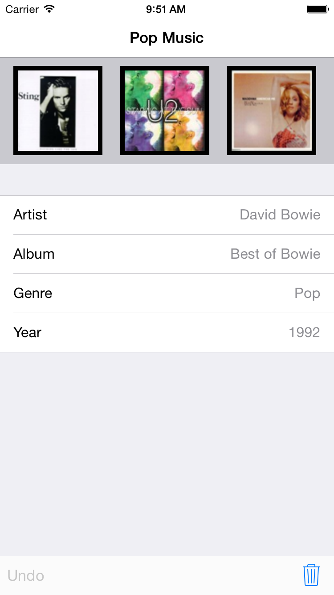

# iOS 设计模式

说到设计模式，相信大家都不陌生，但是又有多少人知道它背后的真正含义？绝大多数程序员都知道设计模式十分重要，不过关于这个话题的文章却不是很多，开发者们在开发的时候有时也不太在意设计模式方面的内容。

设计模式针对软件设计中的常见问题，提供了一些可复用的解决方案，开发者可以通过这些模板写出易于理解且能够复用的代码。正确的使用设计模式可以降低代码之间的耦合度，从而很轻松的修改或者替换以前的代码。

如果你对设计模式还很陌生，那么告诉你一个好消息！在 iOS 的开发过程中，其实你不知不觉已经用了很多设计模式。这得益于 Cocoa 提供的框架和一些良好的编程习惯。接下来的这篇教程将会带你一起飞，去领略设计模式的魅力。

整个教程分为三个部分

## 常见模式

第一部分我们将会完成一个完整的应用，展示音乐专辑和专辑的相关信息。

通过这个应用，我们会接触一些 Cocoa 中常见的设计模式：

- 创建型 (Creational)：单例模式 (Singleton)
- 结构型 (Structural)：MVC、装饰者模式 (Decorator)、适配器模式 (Adapter)、外观模式 (Facade)
- 行为型 (Behavioral)：观察者模式 (Observer)、备忘录模式 (Memento)

嘿嘿嘿别愁眉苦脸的嘛，这篇文章不是什么长篇大论的理论知识，你会在开发应用的过程中慢慢学会这些设计模式。

先来预览一下最终的结果：

## 进阶学习

## 设计模式实现

