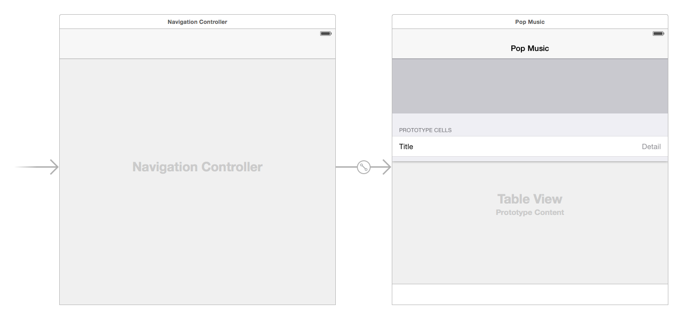

# 开始

下载[初始项目](https://github.com/yourtion/SwiftDesignPatterns-Demo1/archive/starter_project.zip)并解压，在 Xcode 中打开 `BlueLibrarySwift.xcodeproj` 项目文件。

项目中有三个地方需要注意一下：

- `ViewController` 有两个 `IBOutlet` ，分别连接到了 `UITableView` 和 `UIToolBar` 上。

- 在 StoryBoard 上有三个组件设置了约束。最上面的是专辑的封面，封面下面是列举了相关专辑的列表，最下面是有两个按钮的工具栏，一个用来撤销操作，另一个用来删除你选中的专辑。 StoryBoard 看起来是这个样子的：



- 一个简单的 HTTP 客户端类 （HTTPClient) ，里面还没有什么内容，需要你去完善。

> 注意：其实当你创建一个新的 Xcode 的项目的时候，你的代码里就已经有很多设计模式的影子了： MVC、委托、代理、单例 - 真是众里寻他千百度，得来全不费功夫。

在学习第一个设计模式之前，你需要创建两个类，用来存储和展示专辑数据。

创建一个新的类，继承 `NSObject` 名为 `Album` ，记得选择 Swift 作为编程语言然后点击下一步。

打开 `Album.swift` 然后添加如下定义：

```swift
var title : String!
var artist : String!
var genre : String!
var coverUrl : String!
var year : String!
```

这里创建了五个属性，分别对应专辑的标题、作者、流派、封面地址和出版年份。

接下来我们添加一个初始化方法：

```swift
init(title: String, artist: String, genre: String, coverUrl: String, year: String) {
  super.init()
  self.title = title
  self.artist = artist
  self.genre = genre
  self.coverUrl = coverUrl
  self.year = year
}
```

这样我们就可以愉快的初始化了。

然后再加上下面这个方法：

```swift
override var description: String {
	return "title: \(title)" +
	       "artist: \(artist)" +
	       "genre: \(genre)" +
	       "coverUrl: \(coverUrl)" +
	       "year: \(year)"
}
```

这是专辑对象的描述方法，详细的打印了 `Album` 的所有属性值，方便我们查看变量各个属性的值。

接下来，再创建一个继承自 `UIView` 的视图类 `AlbumView.swift`。

在新建的类中添加两个属性：

```swift
private var coverImage: UIImageView!
private var indicator: UIActivityIndicatorView!
```

`coverImage` 代表了封面的图片，`indicator` 则是在加载过程中显示的等待指示器。


这两个属性都是私有属性，因为除了 `AlbumView` 之外，其他类没有必要知道他俩的存在。在写一些框架或者类库的时候，这种规范十分重要，可以避免一些误操作。

接下来给这个类添加初始化化方法：

```swift
required init?(coder aDecoder: NSCoder) {
    super.init(coder: aDecoder)!
}

init(frame: CGRect, albumCover: String) {
    super.init(frame: frame)
    backgroundColor = UIColor.blackColor()
    coverImage = UIImageView(frame: CGRectMake(5, 5, frame.size.width - 10, frame.size.height - 10))
    addSubview(coverImage)
    indicator = UIActivityIndicatorView()
    indicator.center = center
    indicator.activityIndicatorViewStyle = .WhiteLarge
    indicator.startAnimating()
    addSubview(indicator)
}
```

因为 `UIView` 遵从 `NSCoding` 协议，所以我们需要 `NSCoder` 的初始化方法。不过目前我们没有 `encode` 和 `decode` 的必要，所以就把它放在那里就行，调用父类方法初始化即可。

在真正的初始化方法里，我们设置了一些初始化的默认值。比如设置背景颜色默认为黑色，创建 `ImageView` 并设置了 `margin` 值，添加了一个加载指示器。

最终我们再加上如下方法：

```swift
func highlightAlbum(didHighlightView didHighlightView: Bool) {
    if didHighlightView == true {
        backgroundColor = UIColor.whiteColor()
    } else {
        backgroundColor = UIColor.blackColor()
    }
}
```

这会切换专辑的背景颜色，如果高亮就是白色，否则就是黑色。

在继续下面的内容之前， `Command + B` 试一下确保没有什么问题，一切正常？那就开始第一个设计模式的学习啦！

完成到这一步的Demo：

- [查看源码](https://github.com/yourtion/SwiftDesignPatterns-Demo1/tree/GettingStarted) 
- [下载Zip](https://github.com/yourtion/SwiftDesignPatterns-Demo1/archive/GettingStarted.zip)

