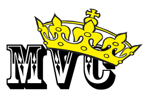
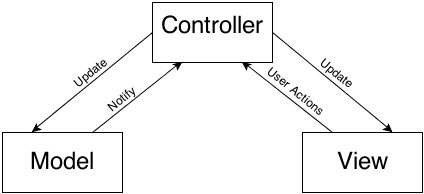

# 设计模式之王 - MVC

`Model-View-Controller` (缩写 MVC ) 是 Cocoa 框架的一部分，并且毋庸置疑是最常用的设计模式之一。它可以帮你把对象根据职责进行划分和归类。

作为划分依据的三个基本职责是：

- 模型层 (Model) ：存储数据并且定义如何操作这些数据。在我们的例子中，就是 `Album` 类。
- 视图层 (View) ：负责模型层的可视化展示，并且负责用户的交互，一般来说都是继承自 `UIView` 这个基类。在我们的项目中就是 `AlbumView` 这个类。
- 控制器 (Controller) ：控制器是整个系统的掌控者，它连接了模型层和数据层，并且把数据在视图层展示出来，监听各种事件，负责数据的各种操作。不妨猜猜在我们的项目中哪个是控制器？啊哈猜对了：`ViewController` 这个类就是。

如果你的项目遵循 MVC 的设计模式，那么各种对象要不是 Model ，要不是 View ，要不就是 Controller。当然在实际的开发中也可以灵活变化，比如结合具体业务使用 MVVM 结构给 `ViewController` 瘦瘦身，也是可以的。

三者之间的关系如下：

模型层通知控制器层任何数据的变化，然后控制器层会刷新视图层中的数据。视图层可以通知控制器层用户的交互事件，然后控制器会处理各种事件以及刷新数据。

你可能会感觉奇怪：为什么要把这三个东西分开来，而不能揉在一个类里呢？那样似乎更简单一点嘛。

之所以这样做，是为了将代码更好的分离和重用。理想状态下，视图层应当和模型层完全分离。如果视图层不依赖任何模型层的具体实现，那么就可以很容易的被其他模型复用，用来展示不同的数据。

举个例子，比如在未来我们需要添加电影或者什么书籍，我们依旧可以使用 `AlbumView` 这个类作为展示。更久远点来说，在以后如果你创建了一个新的项目并且需要用到和专辑相关的内容，你可以直接复用 `Album` 类因为它并不依赖于任何视图模块。这就是 MVC 的强大之处，三大元素，各司其职，减少依赖。

