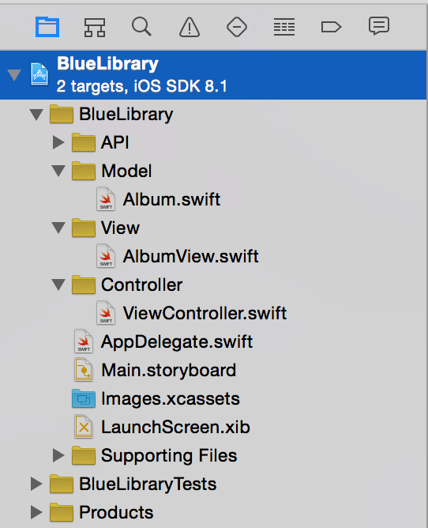

## 如何使用 MVC 模式

首先，你需要确定你的项目中的每个类都是三大基本类型中的一种：控制器、模型、视图。不要在一个类里糅合多个角色。目前我们创建了 `Album` 类和 `AlbumView` 类是符合要求的，做得很好。

然后，为了确保你遵循这种模式，你最好创建三个项目分组来存放代码，分别是 Model、View、Controller，保持每个类型的文件分别独立。

接下来把 `Album.swift` 拖到 `Model` 分组，把 `AlbumView.swift` 拖到 `View` 分组，然后把 `ViewController.swift` 拖到 `Controller` 分组中。

现在你的项目应该是这个样子：

现在你的项目已经有点样子了，不再是各个文件颠沛流离居无定所了。显然你还会有其他分组和类，但是应用的核心就在这三个类里。

现在你的内容已经组织好了，接下来要做的就是获取专辑的数据。你将会创建一个 API 类来管理数据 - 这里我们会用到下一个设计模式：单例模式。
