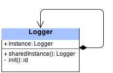

## 如何使用单例模式

可以看下这个图：



这是一个日志类，有一个属性 (是一个单例对象) 和两个方法 (`sharedInstance()` 和 `init()`)。

第一次调用 `sharedInstance()` 的时候，`instance` 属性还没有初始化。所以我们要创建一个新实例并且返回。

下一次你再调用 `sharedInstance()` 的时候，`instance` 已经初始化完成，直接返回即可。这个逻辑确保了这个类只存在一个实例对象。

接下来我们继续完善单例模式，通过这个类来管理专辑数据。

注意到在我们前面的截图里，分组中有个 `API` 分组，这里可以放那些提供后台服务的类。在这个分组中创建一个新的文件 `LibraryAPI.swift` ，继承自 `NSObject` 类。

在 `LibraryAPI` 里添加下面这段代码：

```swift
//1
class var sharedInstance: LibraryAPI {
    //2
    struct Singleton {
        //3
        static let instance = LibraryAPI()
    }
    //4
    return Singleton.instance
}
```

在这几行代码里，做了如下工作：

创建一个计算类型的类变量，这个类变量，就像是 objc 中的静态方法一样，可以直接通过类访问而不用实例对象。具体可参见苹果官方文档的 属性 这一章。

在类变量里嵌套一个 `Singleton` 结构体。

Singleton 封装了一个静态的常量，通过 static 定义意味着这个属性只存在一个，注意 Swift 中 static 的变量是延时加载的，意味着 Instance 直到需要的时候才会被创建。同时再注意一下，因为它是一个常量，所以一旦创建之后不会再创建第二次。这些就是单例模式的核心所在：一旦初始化完成，当前类存在一个实例对象，初始化方法就不会再被调用。

返回计算后的属性值。

注意：更多的单例模式实例可以看看 Github 上的这个示例，列举了单例模式的若干种实现方式。

你现在可以将这个单例作为专辑管理类的入口，接下来我们继续创建一个处理专辑数据持久化的类。

新建 PersistencyManager.swift 并添加如下代码：

private var albums = [Album]()
在这里我们定义了一个私有属性，用来存储专辑数据。这是一个可变数组，所以你可以很容易的增加或者删除数据。

然后加上一些初始化的数据：

```swift
override init() {
  //Dummy list of albums
  let album1 = Album(title: "Best of Bowie",
         artist: "David Bowie",
         genre: "Pop",
         coverUrl: "http://www.coversproject.com/static/thumbs/album/album_david%20bowie_best%20of%20bowie.png",
         year: "1992")

  let album2 = Album(title: "It's My Life",
         artist: "No Doubt",
         genre: "Pop",
         coverUrl: "http://www.coversproject.com/static/thumbs/album/album_no%20doubt_its%20my%20life%20%20bathwater.png",
         year: "2003")

  let album3 = Album(title: "Nothing Like The Sun",
         artist: "Sting",
         genre: "Pop",
         coverUrl: "http://www.coversproject.com/static/thumbs/album/album_sting_nothing%20like%20the%20sun.png",
         year: "1999")

  let album4 = Album(title: "Staring at the Sun",
         artist: "U2",
         genre: "Pop",
         coverUrl: "http://www.coversproject.com/static/thumbs/album/album_u2_staring%20at%20the%20sun.png",
         year: "2000")

  let album5 = Album(title: "American Pie",
         artist: "Madonna",
         genre: "Pop",
         coverUrl: "http://www.coversproject.com/static/thumbs/album/album_madonna_american%20pie.png",
         year: "2000")

  albums = [album1, album2, album3, album4, album5]
}
```

在这个初始化方法里，我们初始化了五张专辑。如果上面的专辑没有你喜欢的，你可以随意替换成你的菜:]

然后添加如下方法：

```swift
func getAlbums() -> [Album] {
  return albums
}

func addAlbum(album: Album, index: Int) {
  if (albums.count >= index) { 
    albums.insert(album, atIndex: index)
  } else {
    albums.append(album)
  }
}

func deleteAlbumAtIndex(index: Int) {
  albums.removeAtIndex(index)
}
```

这些方法可以让你自由的访问、添加、删除专辑数据。

这时你可以运行一下你的项目，确保编译通过以便进行下一步操作。

此时你或许会感到好奇： `PersistencyManager` 好像不是单例啊？是的，它确实不是单例。不过没关系，在接下来的外观模式章节，你会看到 `LibraryAPI` 和 `PersistencyManagerx` 之间的联系。

