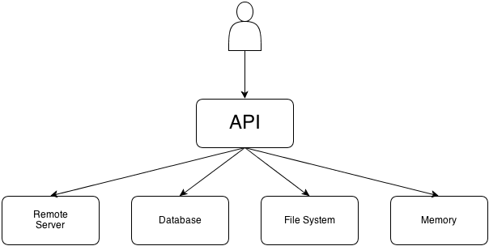

# 外观模式 - Facade

外观模式在复杂的业务系统上提供了简单的接口。如果直接把业务的所有接口直接暴露给使用者，使用者需要单独面对这一大堆复杂的接口，学习成本很高，而且存在误用的隐患。如果使用外观模式，我们只要暴露必要的 API 就可以了。

下图演示了外观模式的基本概念：

API 的使用者完全不知道这内部的业务逻辑有多么复杂。当我们有大量的类并且它们使用起来很复杂而且也很难理解的时候，外观模式是一个十分理想的选择。

外观模式把使用和背后的实现逻辑成功解耦，同时也降低了外部代码对内部工作的依赖程度。如果底层的类发生了改变，外观的接口并不需要做修改。

举个例子，如果有一天你想换掉所有的后台服务，你只需要修改 API 内部的代码，外部调用 API 的代码并不会有改动。
