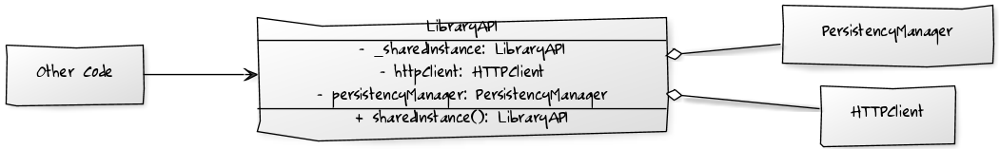
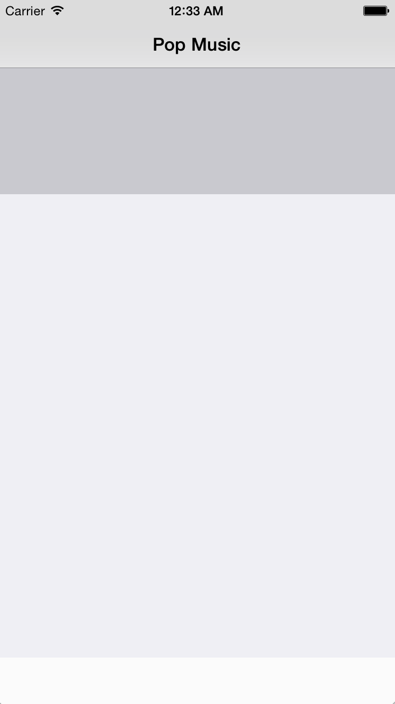

## 如何使用外观模式

现在我们用 `PersistencyManager` 来管理专辑数据，用 `HTTPClient` 来处理网络请求，项目中的其他类不应该知道这个逻辑。他们只需要知道 `LibraryAPI` 这个“外观”就可以了。

为了实现外观模式，应该只让 `LibraryAPI` 持有 `PersistencyManager` 和 `HTTPClient` 的实例，然后 `LibraryAPI` 暴露一个简单的接口给其他类来访问，这样外部的访问类不需要知道内部的业务具体是怎样的，也不用知道你是通过 `PersistencyManager` 还是 `HTTPClient` 获取到数据的。

大致的设计是这样的：



`LibraryAPI` 会暴露给其他代码访问，但是 `PersistencyManager` 和 `HTTPClient` 则是不对外开放的。

打开 `LibraryAPI.swift` 然后添加如下代码：

```swift
private let persistencyManager: PersistencyManager
private let httpClient: HTTPClient
private let isOnline: Bool
```

除了两个实例变量之外，还有个 `Bool` 值： `isOnline` ，这个是用来标识当前是否为联网状态的，如果是联网状态就会去网络获取数据。

我们需要在 `init` 里面初始化这些变量：

```swift
override init() {
  persistencyManager = PersistencyManager()
  httpClient = HTTPClient()
  isOnline = false

  super.init()
}
```

`HTTPClient` 并不会直接和真实的服务器交互，只是用来演示外观模式的使用。所以 `inOnline` 这个值我们一直设置为 `false`。

接下来在 `LibraryAPI.swift` 里添加如下代码：

```swift
func getAlbums() -> [Album] {
  return persistencyManager.getAlbums()
}

func addAlbum(album: Album, index: Int) {
  persistencyManager.addAlbum(album, index: index)
  if isOnline {
    httpClient.postRequest("/api/addAlbum", body: album.description())
  }
}

func deleteAlbum(index: Int) {
  persistencyManager.deleteAlbumAtIndex(index)
  if isOnline {
    httpClient.postRequest("/api/deleteAlbum", body: "\(index)")
  }
}
```

看一下 `addAlbum(_:index:)` 这个方法，先更新本地缓存，然后如果是联网状态还需要向服务器发送网络请求。这便是外观模式的强大之处：如果外部文件想要添加一个新的专辑，它不会也不用去了解内部的实现逻辑是怎么样的。

注意：当你设计外观的时候，请务必牢记：使用者随时可能直接访问你的隐藏类。永远不要假设使用者会遵循你当初的设计做事。

运行一下你的应用，你可以看到两个空的页面和一个工具栏：最上面的视图用来展示专辑封面，下面的视图展示数据列表。



你需要在屏幕上展示专辑数据，这是就该用下一种设计模式了：装饰者模式。

完成到这一步的Demo：

- [查看源码](https://github.com/yourtion/SwiftDesignPatterns-Demo1/tree/Use-Facade) 
- [下载Zip](https://github.com/yourtion/SwiftDesignPatterns-Demo1/archive/Use-Facade.zip)

