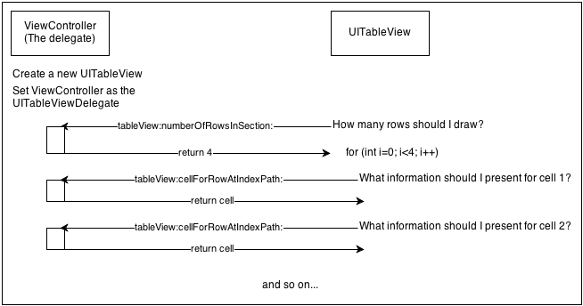

## 委托

装饰者模式的另一种实现方案是委托。在这种机制下，一个对象可以和另一个对象相关联。比如你在用 `UITableView` ，你必须实现 `tableView(_:numberOfRowsInSection:)` 这个委托方法。

你不应该指望 `UITableView` 知道你有多少数据，这是个应用层该解决的问题。所以，数据相关的计算应该通过 `UITableView` 的委托来解决。这样可以让 `UITableView` 和数据层分别独立。视图层就负责显示数据，你递过来什么我就显示什么。

下面这张图很好的解释了 `UITableView` 的工作过程：

`UITableView` 的工作仅仅是展示数据，但是最终它需要知道自己要展示那些数据，这时就可以向它的委托询问。在 objc 的委托模式里，一个类可以通过协议来声明可选或者必须的方法。

看起来似乎继承然后重写必须的方法来的更简单一点。但是考虑一下这个问题：继承的结果必定是一个独立的类，如果你想让某个对象成为多个对象的委托，那么子类这招就行不通了。

注意：委托模式十分重要，苹果在 UIKit 中大量使用了该模式，基本上随处可见。