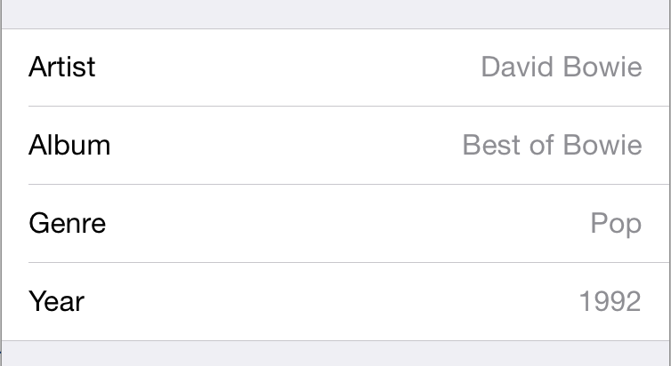
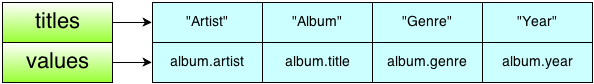

## 如何使用扩展

想象一下这个场景，我们需要在下面这个列表里展示数据：



专辑标题从哪里来？ `Album` 本身是个 Model 对象，所以它不应该负责如何展示数据。你需要一些额外的代码添加展示数据的逻辑，但是为了保持 `Model` 的干净，我们不应该直接修改代码，因为这样不符合单一职责原则。 `Model` 层最好就是负责纯粹的数据结构，如果有数据的操作可以放到扩展中完成。

接下来我们会创建一个扩展，扩展现有的 `Album` 类，在扩展里定义了新的方法，返回更适合 `UITableView` 展示用的数据结构。

数据的结构大概是这样：



新建一个 Swift 文件：`AlbumExtensions` ，在里面添加如下扩展：

```swift
extension Album {
  func ae_tableRepresentation() -> (titles:[String], values:[String]) {
    return (["Artist", "Album", "Genre", "Year"], [artist, title, genre, year])
  }
}
```

在方法的前面有个 `ae_` 前缀，是 `AlbumExtension` 的缩写，这样有利于和类的原有方法进行区分，避免使用的时候产生冲突。现在很多还在维护中的第三方库都已经改成了这个风格。

注意：类是可以重写父类方法的，但是在扩展里不可以。扩展里的方法和属性不能和原始类里的方法和属性冲突。

思考一下这个设计模式的强大之处：

- 我们可以直接在扩展里使用 `Album` 里的属性。
- 我们给 `Album` 类添加了内容但是并没有继承它，事实上，使用继承来扩展业务也可以实现一样的功能。
- 这个简单的扩展让我们可以更好地把 `Album` 的数据展示在 `UITableView` 里，而且不用修改源码。
