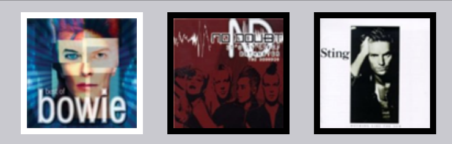
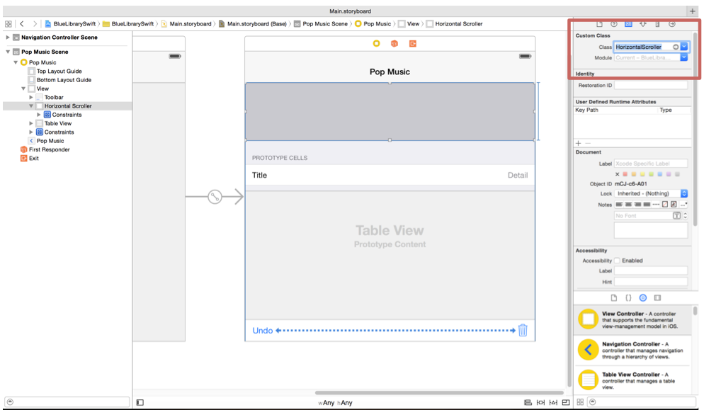
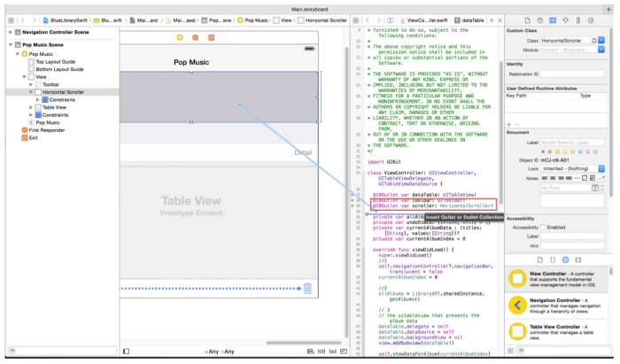
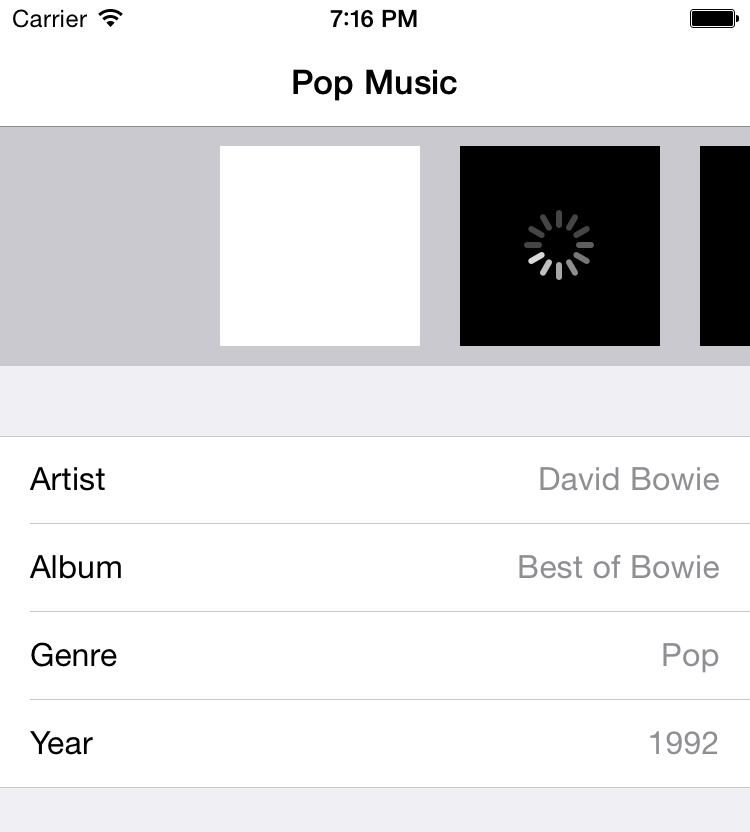

## 如何使用适配器模式

横滑的滚动栏理论上应该是这个样子的：



新建一个 Swift 文件：`HorizontalScroller.swift` ，作为我们的横滑滚动控件， `HorizontalScroller` 继承自 `UIView` 。

打开 `HorizontalScroller.swift` 文件并添加如下代码：

```swift
@objc protocol HorizontalScrollerDelegate {
}
```

这行代码定义了一个新的协议： `HorizontalScrollerDelegate` 。我们在前面加上了 `@objc` 的标记，这样我们就可以像在 objc 里一样使用 `@optional` 的委托方法了。

接下来我们在大括号里定义所有的委托方法，包括必须的和可选的：

```swift
// 在横滑视图中有多少页面需要展示
func numberOfViewsForHorizontalScroller(scroller: HorizontalScroller) -> Int
// 展示在第 index 位置显示的 UIView
func horizontalScrollerViewAtIndex(scroller: HorizontalScroller, index:Int) -> UIView
// 通知委托第 index 个视图被点击了
func horizontalScrollerClickedViewAtIndex(scroller: HorizontalScroller, index:Int)
// 可选方法，返回初始化时显示的图片下标，默认是0
optional func initialViewIndex(scroller: HorizontalScroller) -> Int
```

其中，没有 `option` 标记的方法是必须实现的，一般来说包括那些用来显示的必须数据，比如如何展示数据，有多少数据需要展示，点击事件如何处理等等，不可或缺；有 `option` 标记的方法为可选实现的，相当于是一些辅助设置和功能，就算没有实现也有默认值进行处理。

在 `HorizontalScroller` 类里添加一个新的委托对象：

```swift
weak var delegate: HorizontalScrollerDelegate?
```

为了避免循环引用的问题，委托是 `weak` 类型。如果委托是 `strong` 类型的，当前对象持有了委托的强引用，委托又持有了当前对象的强引用，这样谁都无法释放就会导致内存泄露。

委托是可选类型，所以很有可能当前类的使用者并没有指定委托。但是如果指定了委托，那么它一定会遵循 `HorizontalScrollerDelegate` 里约定的内容。

再添加一些新的属性：

```swift
// 1
private let VIEW_PADDING = 10
private let VIEW_DIMENSIONS = 100
private let VIEWS_OFFSET = 100

// 2
private var scroller : UIScrollView!
// 3
var viewArray = [UIView]()
```

上面标注的三点分别做了这些事情：

- 定义一个常量，用来方便的改变布局。现在默认的是显示的内容长宽为100，间隔为10。
- 创建一个 `UIScrollView` 作为容器。
- 创建一个数组用来存放需要展示的数据

接下来实现初始化方法：

```swift
override init(frame: CGRect) {
    super.init(frame: frame)
    initializeScrollView()
}

required init(coder aDecoder: NSCoder) {
    super.init(coder: aDecoder)
    initializeScrollView()
}

func initializeScrollView() {
    //1
    scroller = UIScrollView()
    addSubview(scroller)

    //2
    scroller.translatesAutoresizingMaskIntoConstraints = false

    //3
    self.addConstraint(NSLayoutConstraint(item: scroller, attribute: .Leading, relatedBy: .Equal, toItem: self, attribute: .Leading, multiplier: 1.0, constant: 0.0))
    self.addConstraint(NSLayoutConstraint(item: scroller, attribute: .Trailing, relatedBy: .Equal, toItem: self, attribute: .Trailing, multiplier: 1.0, constant: 0.0))
    self.addConstraint(NSLayoutConstraint(item: scroller, attribute: .Top, relatedBy: .Equal, toItem: self, attribute: .Top, multiplier: 1.0, constant: 0.0))
    self.addConstraint(NSLayoutConstraint(item: scroller, attribute: .Bottom, relatedBy: .Equal, toItem: self, attribute: .Bottom, multiplier: 1.0, constant: 0.0))

    //4
    let tapRecognizer = UITapGestureRecognizer(target: self, action:Selector("scrollerTapped:"))
    scroller.addGestureRecognizer(tapRecognizer)
}
```

上面的代码做了如下工作：

- 创建一个 `UIScrollView` 对象并且把它加到父视图中。
- 关闭 `autoresizing masks` ，从而可以使用 `AutoLayout` 进行布局。
- 给 `scrollview` 添加约束。我们希望 `scrollview` 能填满 `HorizontalScroller` 。
- 创建一个点击事件，检测是否点击到了专辑封面，如果确实点击到了专辑封面，我们需要通知 `HorizontalScroller` 的委托。

添加委托方法：

```swift
func scrollerTapped(gesture: UITapGestureRecognizer) {
  let location = gesture.locationInView(gesture.view)
  if let delegate = self.delegate {
    for index in 0..<delegate.numberOfViewsForHorizontalScroller(self) {
      let view = scroller.subviews[index] as UIView
      if CGRectContainsPoint(view.frame, location) {
        delegate.horizontalScrollerClickedViewAtIndex(self, index: index)
        scroller.setContentOffset(CGPointMake(view.frame.origin.x - self.frame.size.width/2 + view.frame.size.width/2, 0), animated:true)
        break
      }
    }
  }
}
```

我们把 `gesture` 作为一个参数传了进来，这样就可以获取点击的具体坐标了。

接下来我们调用了 `numberOfViewsForHorizontalScroller` 方法，`HorizontalScroller` 不知道自己的 `delegate` 具体是谁，但是知道它一定实现了 `HorizontalScrollerDelegate` 协议，所以可以放心的调用。

对于 `scroll view` 中的 `view` ，通过 `CGRectContainsPoint` 进行点击检测，从而获知是哪一个 `view` 被点击了。当找到了点击的 `view` 的时候，则会调用委托方法里的 `horizontalScrollerClickedViewAtIndex` 方法通知委托。在跳出 `for` 循环之前，先把点击到的 `view` 居中。

接下来我们再加个方法获取数组里的 `view` ：

```swift
func viewAtIndex(index :Int) -> UIView {
  return viewArray[index]
} 
```

这个方法很简单，只是用来更方便获取数组里的 `view` 而已。在后面实现高亮选中专辑的时候会用到这个方法。

添加如下代码用来重新加载 `scroller` ：

```swift
func reload() {
  // 1 - Check if there is a delegate, if not there is nothing to load.
  if let delegate = self.delegate {
    //2 - Will keep adding new album views on reload, need to reset.
    viewArray = []
    let views: NSArray = scroller.subviews

    // 3 - remove all subviews
    views.enumerateObjectsUsingBlock {
    (object: AnyObject!, idx: Int, stop: UnsafeMutablePointer<ObjCBool>) -> Void in
      object.removeFromSuperview()
    }
    // 4 - xValue is the starting point of the views inside the scroller            
    var xValue = VIEWS_OFFSET
    for index in 0..<delegate.numberOfViewsForHorizontalScroller(self) {
      // 5 - add a view at the right position
      xValue += VIEW_PADDING
      let view = delegate.horizontalScrollerViewAtIndex(self, index: index)
      view.frame = CGRectMake(CGFloat(xValue), CGFloat(VIEW_PADDING), CGFloat(VIEW_DIMENSIONS), CGFloat(VIEW_DIMENSIONS))
      scroller.addSubview(view)
      xValue += VIEW_DIMENSIONS + VIEW_PADDING
      // 6 - Store the view so we can reference it later
     viewArray.append(view)
    }
    // 7
    scroller.contentSize = CGSizeMake(CGFloat(xValue + VIEWS_OFFSET), frame.size.height)

    // 8 - If an initial view is defined, center the scroller on it
    if let initialView = delegate.initialViewIndex?(self) {
      scroller.setContentOffset(CGPointMake(CGFloat(initialView)*CGFloat((VIEW_DIMENSIONS + (2 * VIEW_PADDING))), 0), animated: true)
    }
  }
}
```

这个 `reload` 方法有点像是 `UITableView` 里面的 `reloadData` 方法，它会重新加载所有数据。

一段一段的看下上面的代码：

- 在调用 `reload` 之前，先检查一下是否有委托。
- 既然要清除专辑封面，那么也需要重新设置 `viewArray` ，要不然以前的数据会累加进来。
- 移除先前加入到 `scrollview` 的子视图。
- 所有的 `view` 都有一个偏移量，目前默认是100，我们可以修改 `VIEW_OFFSET` 这个常量轻松的修改它。
- `HorizontalScroller` 通过委托获取对应位置的 `view` 并且把它们放在对应的位置上。
- 把 `view` 存进 `viewArray` 以便后面的操作。
- 当所有 `view` 都安放好了，再设置一下 `content size` 这样才可以进行滑动。
- `HorizontalScroller` 检查一下委托是否实现了 `initialViewIndex()` 这个可选方法，这种检查十分必要，因为这个委托方法是可选的，如果委托没有实现这个方法则用0作为默认值。最终设置 `scroll view` 将初始的 `view` 放置到居中的位置。

当数据发生改变的时候，我们需要调用 `reload` 方法。当 `HorizontalScroller` 被加到其他页面的时候也需要调用这个方法，我们在 `HorizontalScroller.swift` 里面加入如下代码：

```swift
override func didMoveToSuperview() {
    reload()
}
```

在当前 `view` 添加到其他 `view` 里的时候就会自动调用 `didMoveToSuperview` 方法，这样可以在正确的时间重新加载数据。

`HorizontalScroller` 的最后一部分是用来确保当前浏览的内容时刻位于正中心的位置，为了实现这个功能我们需要在用户滑动结束的时候做一些额外的计算和修正。

添加下面这个方法：

```swift
func centerCurrentView() {
    var xFinal = scroller.contentOffset.x + CGFloat((VIEWS_OFFSET/2) + VIEW_PADDING)
    let viewIndex = xFinal / CGFloat((VIEW_DIMENSIONS + (2*VIEW_PADDING)))
    xFinal = viewIndex * CGFloat(VIEW_DIMENSIONS + (2*VIEW_PADDING))
    scroller.setContentOffset(CGPointMake(xFinal, 0), animated: true)
    if let delegate = self.delegate {
        delegate.horizontalScrollerClickedViewAtIndex(self, index: Int(viewIndex))
    }  
}
```

上面的代码计算了当前视图里中心位置距离多少，然后算出正确的居中坐标并滑动到那个位置。最后一行是通知委托所选视图已经发生了改变。

为了检测到用户滑动的结束时间，我们还需要实现 `UIScrollViewDelegate` 的方法。在文件结尾加上下面这个扩展：

```swift
extension HorizontalScroller: UIScrollViewDelegate {
    func scrollViewDidEndDragging(scrollView: UIScrollView, willDecelerate decelerate: Bool) {
        if !decelerate {
            centerCurrentView()
        }
    }

    func scrollViewDidEndDecelerating(scrollView: UIScrollView) {
        centerCurrentView()
    }
}
```

当用户停止滑动的时候，`scrollViewDidEndDragging(_:willDecelerate:)` 这个方法会通知委托。如果滑动还没有停止，`decelerate` 的值为 `true` 。当滑动完全结束的时候，则会调用 `scrollViewDidEndDecelerating` 这个方法。在这两种情况下，你都应该把当前的视图居中，因为用户的操作可能会改变当前视图。

你的 `HorizontalScroller` 已经可以使用了！回头看看前面写的代码，你会看到我们并没有涉及什么 `Album` 或者 `AlbumView` 的代码。这是极好的，因为这样意味着这个 `scroller` 是完全独立的，可以复用。

运行一下你的项目，确保编译通过。

这样，我们的 `HorizontalScroller` 就完成了，接下来我们就要把它应用到我们的项目里了。首先，打开 `Main.Sstoryboard` 文件，点击上面的灰色矩形，设置 `Class` 为 `HorizontalScroller` ：



接下来，在 `assistant editor` 模式下向 `ViewController.swift` 拖拽生成 outlet ，命名为 `scroller` ：



接下来打开 `ViewController.swift` 文件，是时候实现 `HorizontalScrollerDelegate` 委托里的方法啦！

添加如下扩展：

```swift
extension ViewController: HorizontalScrollerDelegate {
    func horizontalScrollerClickedViewAtIndex(scroller: HorizontalScroller, index: Int) {
        //1
        let previousAlbumView = scroller.viewAtIndex(currentAlbumIndex) as AlbumView
        previousAlbumView.highlightAlbum(didHighlightView: false)
        //2
        currentAlbumIndex = index
        //3
        let albumView = scroller.viewAtIndex(index) as AlbumView
        albumView.highlightAlbum(didHighlightView: true)
        //4
        showDataForAlbum(index)
    }
}
```

让我们一行一行的看下这个委托的实现：

- 获取上一个选中的相册，然后取消高亮
- 存储当前点击的相册封面
- 获取当前选中的相册，设置为高亮
- 在 `table view` 里面展示新数据

接下来在扩展里添加如下方法：

```swift
func numberOfViewsForHorizontalScroller(scroller: HorizontalScroller) -> (Int) {
    return allAlbums.count
}
```

这个委托方法返回 `scroll vew` 里面的视图数量，因为是用来展示所有的专辑的封面，所以数目也就是专辑数目。

然后添加如下代码：

```swift
func horizontalScrollerViewAtIndex(scroller: HorizontalScroller, index: Int) -> (UIView) {
    let album = allAlbums[index]
    let albumView = AlbumView(frame: CGRectMake(0, 0, 100, 100), albumCover: album.coverUrl)
    if currentAlbumIndex == index {
        albumView.highlightAlbum(didHighlightView: true)
    } else {
        albumView.highlightAlbum(didHighlightView: false)
    }
    return albumView
}
```

我们创建了一个新的 `AlbumView` ，然后检查一下是不是当前选中的专辑，如果是则设为高亮，最后返回结果。

是的就是这么简单！三个方法，完成了一个横向滚动的浏览视图。

我们还需要创建这个滚动视图并把它加到主视图里，但是在这之前，先添加如下方法：

```swift
func reloadScroller() {
    allAlbums = LibraryAPI.sharedInstance.getAlbums()
    if currentAlbumIndex < 0 {
        currentAlbumIndex = 0
    } else if currentAlbumIndex >= allAlbums.count {
        currentAlbumIndex = allAlbums.count - 1
    } 
    scroller.reload() 
    showDataForAlbum(currentAlbumIndex)
}
```

这个方法通过 `LibraryAPI` 加载专辑数据，然后根据 `currentAlbumIndex` 的值设置当前视图。在设置之前先进行了校正，如果小于0则设置第一个专辑为展示的视图，如果超出了范围则设置最后一个专辑为展示的视图。

接下来只需要指定委托就可以了，在 `viewDidLoad` 最后加入一下代码：

```swift
scroller.delegate = self
reloadScroller()
```

因为 `HorizontalScroller` 是在 `StoryBoard` 里初始化的，所以我们需要做的只是指定委托，然后调用 `reloadScroller()` 方法，从而加载所有的子视图并且展示专辑数据。

标注：如果协议里的方法过多，可以考虑把它分解成几个更小的协议。`UITableViewDelegate` 和 `UITableViewDataSource` 就是很好的例子，它们都是 `UITableView` 的协议。尝试去设计你自己的协议，让每个协议都单独负责一部分功能。

运行一下当前项目，看一下我们的新页面：



等下，滚动视图显示出来了，但是专辑的封面怎么不见了？

啊哈，是的。我们还没完成下载部分的代码，我们需要添加下载图片的方法。因为我们所有的访问都是通过 `LibraryAPI` 实现的，所以很显然我们下一步应该去完善这个类了。不过在这之前，我们还需要考虑一些问题：

- `AlbumView` 不应该直接和 `LibraryAPI` 交互，我们不应该把视图的逻辑和业务逻辑混在一起。
- 同样， `LibraryAPI` 也不应该知道 `AlbumView` 这个类。
- 如果 `AlbumView` 要展示封面，`LibraryAPI` 需要告诉 `AlbumView` 图片下载完成。

看起来好像很难的样子？别绝望，接下来我们会用观察者模式 (`Observer Pattern`) 解决这个问题！:]

完成到这一步的Demo：

- [查看源码](https://github.com/yourtion/SwiftDesignPatterns-Demo1/tree/Adapter) 
- [下载Zip](https://github.com/yourtion/SwiftDesignPatterns-Demo1/archive/Adapter.zip)
