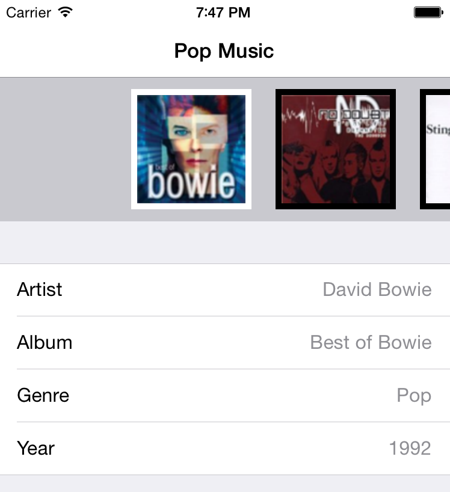

## 键值观察 - KVO

在 KVO 里，对象可以注册监听任何属性的变化，不管它是否持有。如果感兴趣的话，可以读一读[苹果 KVO 编程指南](https://developer.apple.com/library/ios/documentation/Cocoa/Conceptual/KeyValueObserving/KeyValueObserving.html)。

### 如何使用 KVO

正如前面所提及的， 对象可以关注任何属性的变化。在我们的例子里，我们可以用 KVO 关注 `UIImageView` 的 `image` 属性变化。

打开 `AlbumView.swift` 文件，找到 `init(frame:albumCover:)` 方法，在把 `coverImage` 添加到 `subView` 的代码后面添加如下代码：

```swift
coverImage.addObserver(self, forKeyPath: "image", options: nil, context: nil)
```

这行代码把 `self` (也就是当前类) 添加到了 `coverImage` 的 `image` 属性的观察者里。

在销毁的时候，我们也需要取消观察。还是在 `AlbumView.swift` 文件里，添加如下代码：

```swift
deinit {
    coverImage.removeObserver(self, forKeyPath: "image")
}
```

最终添加如下方法：

```swift
override func observeValueForKeyPath(keyPath: String, ofObject object: AnyObject, change: [NSObject : AnyObject], context: UnsafeMutablePointer<Void>) {
    if keyPath == "image" {
        indicator.stopAnimating()
    }
}
```

必须在所有的观察者里实现上面的代码。在检测到属性变化的时候，系统会自动调用这个方法。在上面的代码里，我们在图片加载完成的时候把那个提示加载的小菊花去掉了。

再次运行项目，你会发现一切正常了：



注意：一定要记得移除观察者，否则如果对象已经销毁了还给它发送消息会导致应用崩溃。

此时你可以把玩一下当前的应用然后再关掉它，你会发现你的应用的状态并没有存储下来。最后看见的专辑并不会再下次打开应用的时候出现。

为了解决这个问题，我们可以使用下一种模式：备忘录模式。


