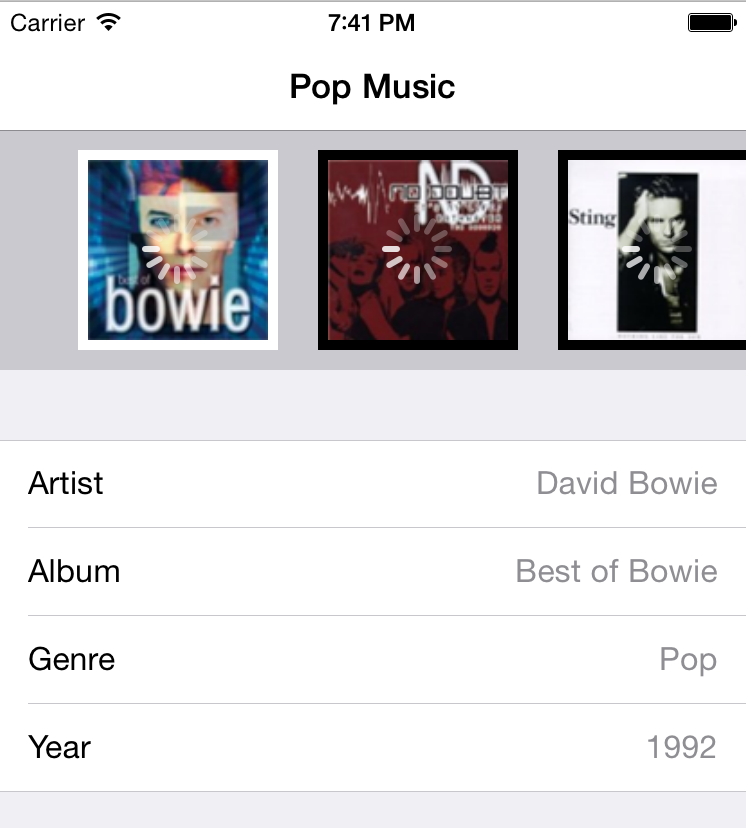

## 通知 - Notification

不要把这里的通知和推送通知或者本地通知搞混了，这里的通知是基于订阅-发布模型的，即一个对象 (发布者) 向其他对象 (订阅者) 发送消息。发布者永远不需要知道订阅者的任何数据。

Apple 对于通知的使用很频繁，比如当键盘弹出或者收起的时候，系统会分别发送 `UIKeyboardWillShowNotification/UIKeyboardWillHideNotification` 的通知。当你的应用切到后台的时候，又会发送 `UIApplicationDidEnterBackgroundNotification` 的通知。

注意：打开 `UIApplication.swift` 文件，在文件结尾你会看到二十多种系统发送的通知。

### 如何使用通知

打开 `AlbumView.swift` 然后在 `init` 的最后插入如下代码：

```swift
NSNotificationCenter.defaultCenter().postNotificationName("BLDownloadImageNotification", object: self, userInfo: ["imageView":coverImage, "coverUrl" : albumCover])
```

这行代码通过 `NSNotificationCenter` 发送了一个通知，通知信息包含了 `UIImageView` 和图片的下载地址。这是下载图像需要的所有数据。

然后在 `LibraryAPI.swift` 的 `init` 方法的 `super.init()` 后面加上如下代码：

```swift
NSNotificationCenter.defaultCenter().addObserver(self, selector:"downloadImage:", name: "BLDownloadImageNotification", object: nil)
```

这是等号的另一边：观察者。每当 `AlbumView` 发出一个 `BLDownloadImageNotification` 通知的时候，由于 `LibraryAPI` 已经注册了成为观察者，所以系统会调用 `downloadImage()` 方法。

但是，在实现 `downloadImage()` 之前，我们必须先在 `dealloc` 里取消监听。如果没有取消监听消息，消息会发送给一个已经销毁的对象，导致程序崩溃。

在 `LibaratyAPI.swift` 里加上取消订阅的代码：

```swift
deinit {
    NSNotificationCenter.defaultCenter().removeObserver(self)
}
```

当对象销毁的时候，把它从所有消息的订阅列表里去除。

这里还要做一件事情：我们最好把图片存储到本地，这样可以避免一次又一次下载相同的封面。

打开 `PersistencyManager.swift` 添加如下代码：

```swift
func saveImage(image: UIImage, filename: String) {
    let path = NSHomeDirectory().stringByAppendingString("/Documents/\(filename)")
    let data = UIImagePNGRepresentation(image)
    data.writeToFile(path, atomically: true)
}

func getImage(filename: String) -> UIImage? {
    var error: NSError?
    let path = NSHomeDirectory().stringByAppendingString("/Documents/\(filename)")
    let data = NSData(contentsOfFile: path, options: .UncachedRead, error: &error)
    if let unwrappedError = error {
        return nil
    } else {
        return UIImage(data: data!)
    }
}
```

代码很简单直接，下载的图片会存储在 `Documents` 目录下，如果没有检查到缓存文件， `getImage()` 方法则会返回 `nil` 。

然后在 `LibraryAPI.swift` 添加如下代码：

```swift
func downloadImage(notification: NSNotification) {
    //1
    let userInfo = notification.userInfo as [String: AnyObject]
    var imageView = userInfo["imageView"] as UIImageView?
    let coverUrl = userInfo["coverUrl"] as NSString

    //2
    if let imageViewUnWrapped = imageView {
        imageViewUnWrapped.image = persistencyManager.getImage(coverUrl.lastPathComponent)
        if imageViewUnWrapped.image == nil {
            //3
            dispatch_async(dispatch_get_global_queue(DISPATCH_QUEUE_PRIORITY_DEFAULT, 0), { () -> Void in
                let downloadedImage = self.httpClient.downloadImage(coverUrl)
                //4
                dispatch_sync(dispatch_get_main_queue(), { () -> Void in
                    imageViewUnWrapped.image = downloadedImage
                    self.persistencyManager.saveImage(downloadedImage, filename: coverUrl.lastPathComponent)
                })
            })
        }
    }
}
```

拆解一下上面的代码：

- `downloadImage` 通过通知调用，所以这个方法的参数就是 `NSNotification` 本身。 `UIImageView` 和 `URL` 都可以从其中获取到。
- 如果以前下载过，从 `PersistencyManager` 里获取缓存。
- 如果图片没有缓存，则通过 `HTTPClient` 获取。
- 如果下载完成，展示图片并用 `PersistencyManager` 存储到本地。

再回顾一下，我们使用外观模式隐藏了下载图片的复杂程度。通知的发送者并不在乎图片是如何从网上下载到本地的。

运行一下项目，可以看到专辑封面已经显示出来了：



关了应用再重新运行，注意这次没有任何延时就显示了所有的图片，因为我们已经有了本地缓存。我们甚至可以在没有网络的情况下正常使用我们的应用。不过出了问题：这个用来提示加载网络请求的小菊花怎么一直在显示！

我们在下载图片的时候开启了这个白色小菊花，但是在图片下载完毕的时候我们并没有停掉它。我们可以在每次下载成功的时候发送一个通知，但是我们不这样做，这次我们来用用另一个观察者模式： KVO 。
