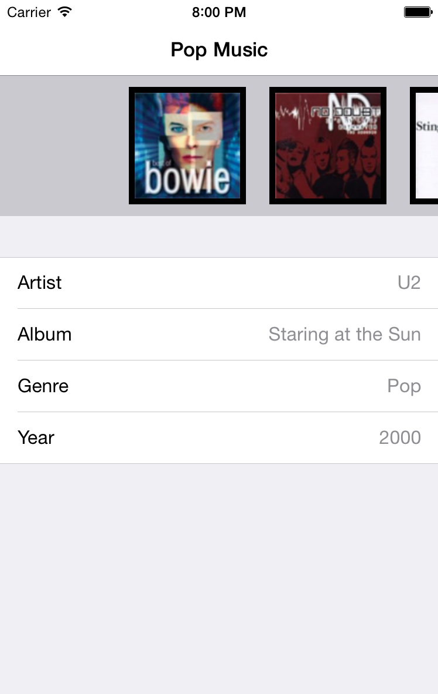
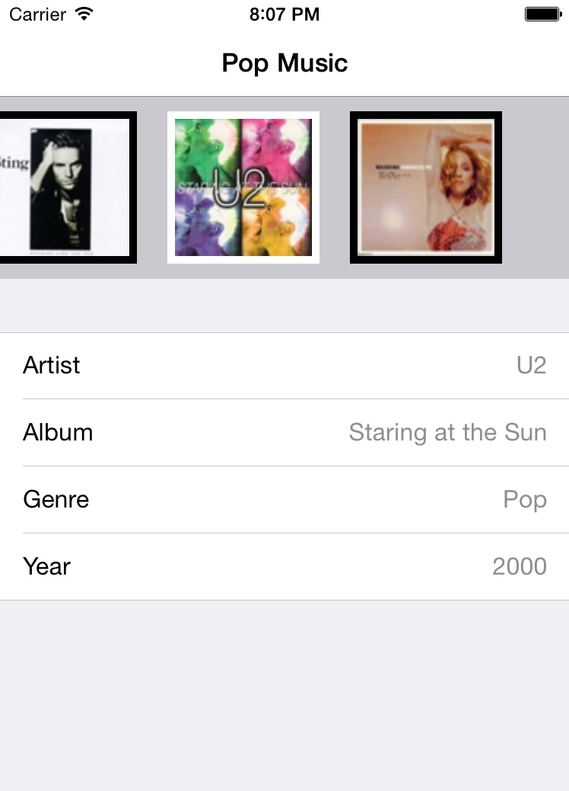

## 如何使用备忘录模式

在 `ViewController.swift` 里加上下面两个方法：

```swift
//MARK: Memento Pattern
func saveCurrentState() {
    // When the user leaves the app and then comes back again, he wants it to be in the exact same state
    // he left it. In order to do this we need to save the currently displayed album.
    // Since it's only one piece of information we can use NSUserDefaults.
    NSUserDefaults.standardUserDefaults().setInteger(currentAlbumIndex, forKey: "currentAlbumIndex")
}

func loadPreviousState() {
    currentAlbumIndex = NSUserDefaults.standardUserDefaults().integerForKey("currentAlbumIndex")
    showDataForAlbum(currentAlbumIndex)
}
```

`saveCurrentState` 把当前相册的索引值存到 `NSUserDefaults` 里。`NSUserDefaults` 是 iOS 提供的一个标准存储方案，用于保存应用的配置信息和数据。

`loadPreviousState` 方法加载上次存储的索引值。这并不是备忘录模式的完整实现，但是已经离目标不远了。

接下来在 `viewDidLoad` 的 `scroller.delegate = self` 前面调用：

```swift
loadPreviousState()
```

这样在刚初始化的时候就加载了上次存储的状态。但是什么时候存储当前状态呢？这个时候我们可以用通知来做。在应用进入到后台的时候， iOS 会发送一个 `UIApplicationDidEnterBackgroundNotification` 的通知，我们可以在这个通知里调用 `saveCurrentState` 这个方法。是不是很方便？

在 `viewDidLoa` 的最后加上如下代码：

```swift
NSNotificationCenter.defaultCenter().addObserver(self, selector:"saveCurrentState", name: UIApplicationDidEnterBackgroundNotification, object: nil)
```

现在，当应用即将进入后台的时候，`ViewController` 会调用 `saveCurrentState` 方法自动存储当前状态。

当然也别忘了取消监听通知，添加如下代码：

```swift
deinit {
    NSNotificationCenter.defaultCenter().removeObserver(self)
}
```

这样就确保在 `ViewController` 销毁的时候取消监听通知。

这时再运行程序，随意移到某个专辑上，然后按下 Home 键把应用切换到后台，再在 Xcode 上把 App 关闭。重新启动，会看见上次记录的专辑已经存了下来并成功还原了：



看起来专辑数据好像是对了，但是上面的滚动条似乎出了问题，没有居中啊！

这时 `initialViewIndex` 方法就派上用场了。由于在委托里 (也就是 `ViewController` ) 还没实现这个方法，所以初始化的结果总是第一张专辑。

为了修复这个问题，我们可以在 `ViewController.swift` 里添加如下代码：

```swift
func initialViewIndex(scroller: HorizontalScroller) -> Int {
    return currentAlbumIndex
}
```

现在 `HorizontalScroller` 可以根据 `currentAlbumIndex` 自动滑到相应的索引位置了。

再次重复上次的步骤，切到后台，关闭应用，重启，一切顺利：



回头看看 `PersistencyManager` 的 `init` 方法，你会发现专辑数据是我们硬编码写进去的，而且每次创建 `PersistencyManager` 的时候都会再创建一次专辑数据。而实际上一个比较好的方案是只创建一次，然后把专辑数据存到本地文件里。我们如何把专辑数据存到文件里呢？

一种方案是遍历 Album 的属性然后把它们写到一个 `plist` 文件里，然后如果需要的时候再重新创建 `Album` 对象。这并不是最好的选择，因为数据和属性不同，你的代码也就要相应的产生变化。举个例子，如果我们以后想添加 `Movie` 对象，它有着完全不同的属性，那么存储和读取数据又需要重写新的代码。

况且你也无法存储这些对象的私有属性，因为其他类是没有访问权限的。这也就是为什么 Apple 提供了 归档 的机制。

